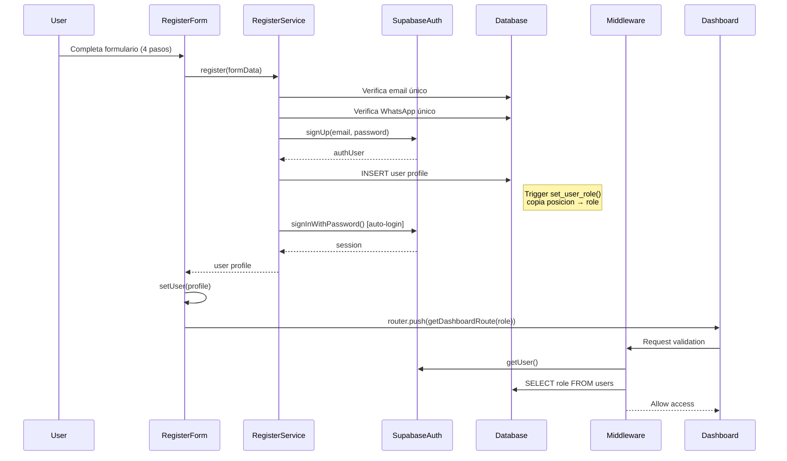
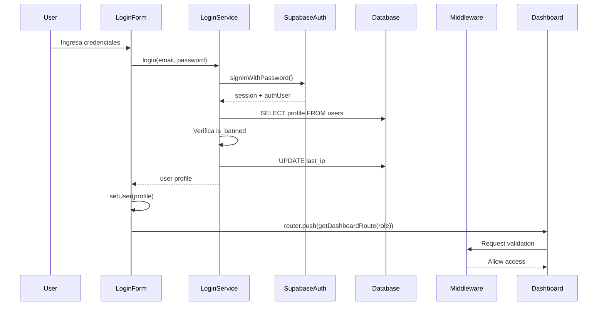
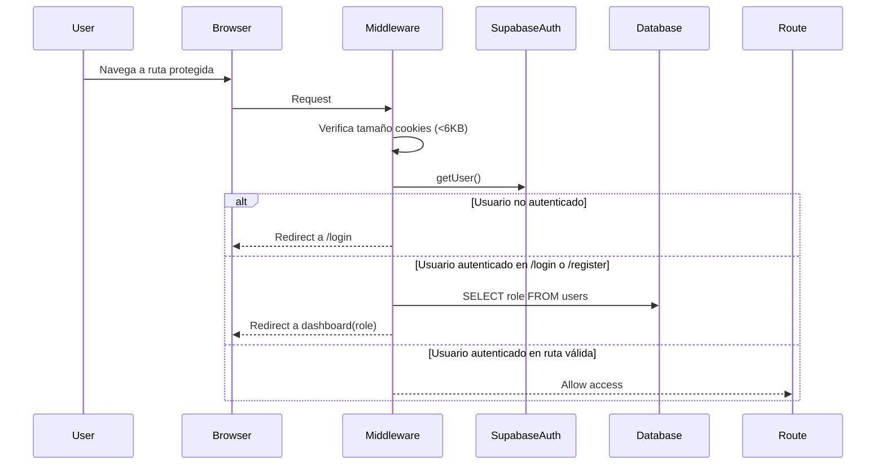

# Arquitectura de Autenticación FLY-ZULU

## Visión General

FLY-ZULU implementa un sistema de autenticación basado en roles utilizando Supabase Auth y Next.js 16 App Router. El sistema soporta 6 roles diferentes con dashboards específicos para cada uno.

## Stack Tecnológico

- **Autenticación:** Supabase Auth (email/password)
- **Base de Datos:** PostgreSQL via Supabase
- **Framework:** Next.js 16 App Router
- **State Management:** Zustand
- **Validación:** Zod
- **Middleware:** Next.js Middleware con Supabase SSR

## Arquitectura de Capas

```
┌─────────────────────────────────────────────────────────────┐
│                    PRESENTATION LAYER                        │
│  - LoginForm Component                                       │
│  - RegisterForm Component                                    │
│  - Zustand Auth Store                                        │
└──────────────────────┬──────────────────────────────────────┘
                       │
                       ↓
┌─────────────────────────────────────────────────────────────┐
│                     MIDDLEWARE LAYER                         │
│  - Next.js Middleware                                        │
│  - Session Validation                                        │
│  - Route Protection                                          │
│  - Role-based Redirects                                      │
└──────────────────────┬──────────────────────────────────────┘
                       │
                       ↓
┌─────────────────────────────────────────────────────────────┐
│                     SERVICE LAYER                            │
│  - login() Server Action                                     │
│  - register() Server Action                                  │
│  - logout() Server Action                                    │
│  - getSession() Server Action                                │
└──────────────────────┬──────────────────────────────────────┘
                       │
                       ↓
┌─────────────────────────────────────────────────────────────┐
│                     DATA LAYER                               │
│  - Supabase Client (Server)                                  │
│  - Supabase Service Role Client                              │
│  - PostgreSQL Database                                       │
└─────────────────────────────────────────────────────────────┘
```

## Flujo de Datos

### 1. Flujo de Registro



### 2. Flujo de Login



### 3. Flujo de Protección de Rutas



## Esquema de Base de Datos

### Tabla: users

```sql
CREATE TABLE users (
  id UUID PRIMARY KEY,              -- Mismo que auth.users.id
  email TEXT UNIQUE NOT NULL,
  nombre TEXT NOT NULL,
  whatsapp TEXT UNIQUE NOT NULL,
  categoria user_category NOT NULL, -- 'FLIGHT' | 'GROUND'
  posicion user_position NOT NULL,  -- 'PILOT' | 'FA' | 'OPS' | 'TRAFICO' | 'MANTTO'
  role user_role NOT NULL,          -- Auto-asignado por trigger
  strikes INTEGER DEFAULT 0,
  is_banned BOOLEAN DEFAULT FALSE,
  subscription_tier subscription_tier DEFAULT 'FREE',
  subscription_expires_at TIMESTAMPTZ,
  device_fingerprint TEXT,
  last_ip TEXT,
  created_at TIMESTAMPTZ DEFAULT NOW(),
  updated_at TIMESTAMPTZ DEFAULT NOW()
);
```

### Trigger: Auto-asignar Role

```sql
CREATE OR REPLACE FUNCTION set_user_role()
RETURNS TRIGGER AS $$
BEGIN
  NEW.role = NEW.posicion::text::user_role;
  RETURN NEW;
END;
$$ LANGUAGE plpgsql;

CREATE TRIGGER set_role_on_insert
  BEFORE INSERT ON users
  FOR EACH ROW
  EXECUTE FUNCTION set_user_role();
```

**Importante:** El trigger garantiza que `role = posicion` automáticamente al crear el usuario.

## Mapeo de Roles a Dashboards

| Role       | Dashboard Path       | Descripción                |
|------------|---------------------|----------------------------|
| PILOT      | `/pilot/mcdu`       | Panel de piloto            |
| FA         | `/fa/vuelo`         | Panel de sobrecargo        |
| OPS        | `/ops/control`      | Panel de operaciones       |
| TRAFICO    | `/trafico/tiempos`  | Panel de tráfico           |
| MANTTO     | `/mantto/transit`   | Panel de mantenimiento     |
| SUPERADMIN | `/admin/metrics`    | Panel de administración    |

## Componentes Clave

### 1. Helper Functions (`src/shared/utils/auth-routes.ts`)

```typescript
// Centraliza la lógica de redirección
export function getDashboardRoute(role: UserRole): string
export function isPublicRoute(pathname: string): boolean
export function isAuthRoute(pathname: string): boolean
```

**Beneficios:**
- DRY: Evita duplicación de lógica
- KISS: Código simple y predecible
- Type-safe: TypeScript valida roles en compile-time

### 2. Middleware (`src/shared/lib/supabase/middleware.ts`)

**Responsabilidades:**
- Validar sesión en cada request
- Prevenir cookies >6KB (HTTP 431)
- Redirigir usuarios no autenticados a `/login`
- Redirigir usuarios autenticados desde `/login` a su dashboard
- Permitir rutas públicas sin autenticación

**Optimización:**
- Solo consulta la base de datos cuando es necesario
- Cachea cliente de Supabase
- Usa SSR cookies para mejor performance

### 3. Server Actions (`src/features/auth/services/index.ts`)

#### `login(email, password)`
1. Autentica con Supabase Auth
2. Obtiene perfil de tabla `users`
3. Verifica si usuario está baneado
4. Actualiza `last_ip`
5. Retorna perfil completo

#### `register(formData)`
1. Valida email único
2. Valida WhatsApp único
3. Crea usuario en Supabase Auth
4. Inserta perfil en tabla `users` (trigger asigna role)
5. **Login automático** para establecer sesión
6. Retorna perfil completo

**Importante:** El login automático es crítico. Sin él, el usuario sería creado pero no autenticado, y el middleware lo redigiría a `/login`.

### 4. Zustand Store (`src/features/auth/store/index.ts`)

```typescript
interface AuthStore {
  user: User | null
  isLoading: boolean
  isAuthenticated: boolean
  setUser: (user: User | null) => void
  clearUser: () => void
}
```

**Estado en cliente:**
- Sincronizado con Supabase session
- Persiste datos de usuario para UI
- No se usa para validación de permisos (solo en server)

## Seguridad

### Row Level Security (RLS)

```sql
-- Users: Solo pueden ver su propio perfil
CREATE POLICY "Users can view own profile" ON users
  FOR SELECT USING (auth.uid() = id OR EXISTS (
    SELECT 1 FROM users WHERE id = auth.uid() AND role = 'SUPERADMIN'
  ));

-- Users: Solo pueden actualizar su propio perfil
CREATE POLICY "Users can update own profile" ON users
  FOR UPDATE USING (auth.uid() = id);
```

### Validación de Entrada

**Zod Schemas:**
```typescript
// Login
const loginSchema = z.object({
  email: z.string().email(),
  password: z.string().min(8),
})

// Register
const registerSchema = z.object({
  nombre: z.string().min(2),
  email: z.string().email(),
  password: z.string().min(8),
  whatsapp: z.string().regex(/^\+?[1-9]\d{9,14}$/),
  categoria: z.enum(['FLIGHT', 'GROUND']),
  posicion: z.enum(['PILOT', 'FA', 'OPS', 'TRAFICO', 'MANTTO']),
  // ... términos y condiciones
})
```

### Prevención de HTTP 431

```typescript
// Middleware verifica tamaño de cookies
const cookieSize = new TextEncoder().encode(cookieHeader).length
if (cookieSize > 6000) {
  // Limpia cookies y redirige a login
}
```

**Por qué:** Supabase almacena datos en JWT dentro de cookies. Si el payload es muy grande (ej. avatares base64), puede exceder límites de navegadores.

**Solución:** Nunca almacenar datos pesados en `user_metadata`. Usar Supabase Storage para archivos.

## Patrones de Diseño

### 1. Server Actions Pattern

**Ventajas:**
- Type-safe data fetching
- No necesidad de API routes para operaciones simples
- Automáticamente serializa/deserializa datos
- Integración nativa con React Server Components

**Ejemplo:**
```typescript
'use server'

export async function login(email: string, password: string) {
  const supabase = await createServerSupabaseClient()
  // Lógica de autenticación...
}
```

### 2. Middleware Protection Pattern

**Ventajas:**
- Protección a nivel de infraestructura (antes de renderizar)
- Performance: valida una sola vez por request
- Centraliza lógica de redirección
- Compatible con ISR y SSR

### 3. Role-Based Access Control (RBAC)

**Niveles de protección:**
1. **Middleware:** Previene acceso no autenticado
2. **RLS:** Previene lectura/escritura no autorizada en DB
3. **Components:** Oculta UI basada en permisos
4. **Server Actions:** Valida permisos antes de operación

## Consideraciones de Performance

### 1. Session Caching

- Supabase SSR mantiene sesión en cookies
- No requiere consulta DB en cada request (solo middleware)
- Token JWT se valida en edge

### 2. Database Queries

```typescript
// ✅ GOOD: Solo consulta cuando es necesario
if (user && isAuthRoute(pathname)) {
  const { data: profile } = await supabase
    .from('users')
    .select('role')  // Solo el campo necesario
    .eq('id', user.id)
    .single()
}

// ❌ BAD: Consulta innecesaria
const profile = await supabase.from('users').select('*').single()
```

### 3. Client-side State

- Zustand store evita prop drilling
- Minimiza re-renders usando selectores
- No persiste en localStorage (datos sensibles)

## Manejo de Errores

### Estrategia de 3 niveles:

1. **Validación de formulario (Cliente)**
   ```typescript
   const form = useForm({ resolver: zodResolver(loginSchema) })
   ```

2. **Server Action Errors**
   ```typescript
   if (error) {
     return { data: null, error: error.message }
   }
   ```

3. **UI Feedback**
   ```typescript
   if (result.error) {
     toast.error(result.error)
     return
   }
   ```

## Testing Strategy

### Unit Tests
- Zod schemas validation
- Helper functions (`getDashboardRoute`, etc.)
- Zustand store actions

### Integration Tests
- Server actions con mock Supabase
- Middleware redirects
- Form submissions

### E2E Tests
- Flujo completo de registro
- Flujo completo de login
- Protección de rutas
- Role-based redirects

## Troubleshooting

### Debug Checklist

1. **Usuario no redirige después de registro:**
   - [ ] Verificar login automático se ejecuta
   - [ ] Verificar cookies de Supabase están set
   - [ ] Verificar trigger `set_user_role` está activo
   - [ ] Verificar campo `role` existe en DB

2. **Middleware loop infinito:**
   - [ ] Verificar rutas públicas excluidas correctamente
   - [ ] Verificar no hay redirección de `/login` a `/login`
   - [ ] Verificar `getDashboardRoute()` retorna ruta válida

3. **CORS errors:**
   - [ ] Verificar variables de entorno
   - [ ] Verificar dominio en Supabase dashboard
   - [ ] Verificar no hay proxies bloqueando

## Próximas Mejoras

1. **OAuth Providers:** Google, GitHub, etc.
2. **2FA:** Autenticación de dos factores
3. **Magic Links:** Login sin password
4. **Session Timeout:** Auto-logout después de inactividad
5. **Device Fingerprinting:** Detectar dispositivos sospechosos
6. **Rate Limiting:** Prevenir ataques de fuerza bruta

---

**Última actualización:** 2026-01-15
**Versión:** 1.0
